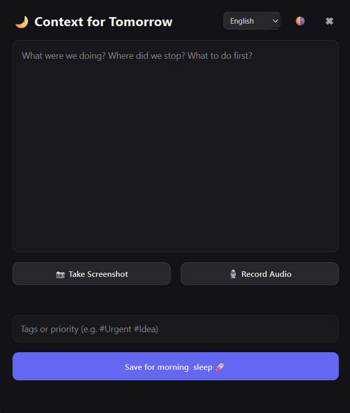

# 🌙 Night Focus

Небольшое десктопное приложение поверх всех окон, которое борется с «потерей контекста перед сном»: тем моментом, когда перед сном вспоминаешь важную мысль или останавливаешься на середине задачи — а утром уже не помнишь деталей.

Night Focus работает в две фазы. Вечером — быстро сохрани текстовую заметку, скриншот и голосовое сообщение, и ложись спать. Утром приложение само откроется с этим контекстом, готовым к просмотру за один взгляд.

*Read in English: [README.md](README.md)*

## Возможности

- **Двухфазный режим работы** — захват вечером, просмотр утром. Приложение само определяет, в какой оно фазе.
- **Скриншот в один клик**, прикрепляется к сессии.
- **Голосовые заметки** — запись с микрофона и воспроизведение одной кнопкой.
- **Метки/приоритеты** (`#Срочно`, `#Идея` и т.д.).
- **Глобальная горячая клавиша** (`Ctrl+Alt+N` по умолчанию) — вызов окна из любого места.
- **Системный трей** — закрытие окна просто прячет его; приложение продолжает тихо работать в фоне.
- **Автозапуск при входе в систему** на Windows, macOS и Linux.
- **Шесть языков** «из коробки» — English, Русский, Español, Deutsch, Français, Português — переключаются в любой момент прямо в шапке окна.
- **Тёмная и светлая темы.**
- **Хранение данных по пользователю** в стандартной системной папке приложения, а не разбросанные файлы в домашней директории.
- **Устойчивость к ошибкам** — приложение продолжает работать без микрофона, без прав на регистрацию горячей клавиши или без прав на включение автозапуска. Каждая из этих ситуаций перехватывается и показывается как небольшое сообщение, а не приводит к падению.

## Скриншоты

## Скриншоты


## Установка

### Требования

- Python 3.10+ (рекомендуется 3.12)
- Windows, macOS или Linux с графической сессией

### Из исходников

```bash
git clone https://github.com/<your-username>/night-focus.git
cd night-focus
python -m venv venv

# Windows
venv\Scripts\activate
# macOS / Linux
source venv/bin/activate

pip install -r requirements.txt
python main.py
```

> **Заметка про Linux:** глобальная горячая клавиша использует пакет `keyboard`, который читает устройства ввода напрямую — обычно для этого нужны права root или разовая настройка udev-правила. Без этого Night Focus всё равно нормально работает — просто открывать его нужно будет через значок в трее, а не через `Ctrl+Alt+N`.

## Сборка исполняемого файла

```bash
pip install pyinstaller
pyinstaller --noconfirm --windowed --name "NightFocus" main.py
```

Результат появится в `dist/NightFocus/`. Флаг `--windowed` скрывает консоль на Windows; на macOS в результате получится `.app`-бандл. Добавьте `--icon path/to/icon.ico` (Windows) или `--icon path/to/icon.icns` (macOS), если у вас есть своя иконка.

## Где хранятся данные

| ОС      | Расположение                                                       |
|---------|-------------------------------------------------------------------|
| Windows | `%LOCALAPPDATA%\NightFocus`                                       |
| macOS   | `~/Library/Application Support/NightFocus`                        |
| Linux   | `$XDG_DATA_HOME/nightfocus` (по умолчанию `~/.local/share/nightfocus`) |

Настройки (язык, тема, горячая клавиша) хранятся в `settings.json` в той же папке; ночная сессия — в `session.json` вместе со скриншотом и голосовой заметкой, и удаляется после того, как вы отметите её выполненной.

## Структура проекта

```
night_focus/
├── main.py                    # точка входа
├── config.py                  # пути, значения по умолчанию, константы
├── gui/
│   ├── main_window.py         # окно без рамки, шапка, переключение режимов
│   ├── night_view.py          # интерфейс захвата
│   ├── morning_view.py        # интерфейс просмотра
│   ├── tray.py                # значок в системном трее
│   ├── styles.py               # тёмная/светлая темы (QSS)
│   └── animations.py          # плавное появление/скрытие
├── services/
│   ├── audio_service.py       # запись с микрофона
│   ├── screenshot_service.py  # захват экрана
│   ├── autostart_service.py   # автозапуск для Windows/macOS/Linux
│   ├── hotkey_service.py      # глобальная горячая клавиша с фоллбэком
│   └── storage_service.py     # чтение/запись JSON-сессии и настроек
├── locales/
│   ├── en.py / ru.py / es.py / de.py / fr.py / pt.py
│   └── __init__.py            # загрузчик с фоллбэком на английский
├── requirements.txt
└── README.md
```

## Горячая клавиша

По умолчанию: `Ctrl+Alt+N`. Чтобы изменить — отредактируйте `"hotkey"` в `settings.json` (подходит любая комбинация, понятная библиотеке [`keyboard`](https://github.com/boppreh/keyboard), например `"ctrl+shift+space"`).

## Планы на будущее

- Просмотр истории прошлых ночей, а не только последней сессии
- Изменение горячей клавиши прямо из интерфейса, без правки `settings.json`
- Экспорт заметок ночи в Markdown

## Участие в разработке

Issues и pull request'ы приветствуются. Перед отправкой PR запустите `python -m py_compile $(git ls-files '*.py')` или удобный вам линтер.

## Лицензия

MIT — см. [LICENSE](LICENSE).
